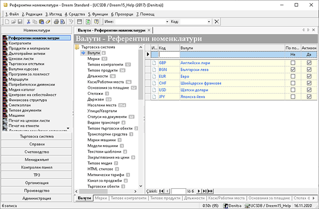

## Как да въведем Валути

### Въведение

В тази статия:
 - [Въвеждане на валута](#въвеждане-на-валута)

Валутите са референтна номенклатура. Тук се въвеждат валутите, с които ще се работи в системата. По подразбиране основната валута е BGN (лева). Валутите се използват на много места в системата и най-вече при въвеждане на документи за покупки или продажби, водене на валутни ценови листи и т.н. При въведени валути и съответните дневни курсове, системата автоматично преизчислява всеки валутен документ към основната валута по подразбиране (в случая към BGN).

 
### Въвеждане на валута

1. За да въведем нова **Валута**, избираме последователно група функции **Номенклатури || Референтни номенклатури || Валути**. В дясната част на екрана системата визуализира списък с Валути.

    

2. На реда за добавяне на нови записи, най-отгоре на списъка, записваме: в полето **Код** - желания код (съкращение на валутата), а в полето **Валути** - наименованието на съответната валута.

3. **Запис** от лентата с инструменти.

 
### Заключение

Валутите в системата се въвеждат само ако се използват. Валутата по подразбиране е BGN и се предлага автоматично от системата. Разбира се тя може да бъде сменена, като се избере отметка на желаната валута в колоната По подразбиране.

Валутите в системата се използват при въвеждане на валутни покупки, водене на валутни ценови листи или създаване на валутни продажби и фактури. Всички тези документи се преизчисляват от системата към основната валута по подразбиране със съответния курс.
