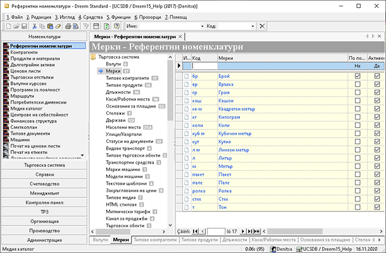

## Как да въведем Мерки

### Въведение

В тази статия:
 - [Въвеждане на мярка](#въвеждане-на-мярка)

Всеки продукт в системата Dreem изисква мярка. Именно тези мерки се въвеждат през **Референтни номенклатури || Мерки**. В дясната част на екрана системата визуализира списък с въведените до момента мерни единици. Тук можете да промените или да добавите нови.

Корекция на мярка се извършва директно през полето **Мерки**, а изтриване е възможно само в случаите, когато няма свързан продукт към съответната мярка.

 
### Въвеждане на мярка

1. За да въведем нова **Мярка**, избираме последователно група функции **Номенклатури || Референтни номенклатури || Мерки**.

    

2. На реда за добавяне на нови записи, най-отгоре на списъка, записваме: в полето **Код** - съкращението на мерната единица, а в полето **Мерки** – желаното наименование.

3. **Запис** от лентата с инструменти.

 
### Заключение

Мерките са базова настройка, с която са обвързани всички продукти в системата. Те са задължителен реквизит при въвеждане на продукт.

Избраната **Мярка** по подразбиране се предлага автоматично от системата при въвеждане на нов продукт.
